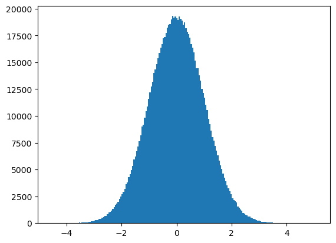

<a href="https://colab.research.google.com/drive/1gmnUN5sqWh7SgP3PJgpU1S5eP-Vr_wvT">Abre este Jupyter en Google Colab</a>

# Introducción a NumPy

[Numpy](https://numpy.org) es una librería fundamental para la computación científica con Python.
* Proporciona arrays N-dimensionales
* Implementa funciones matemáticas sofisticadas
* Proporciona herramientas para integrar C/C++ y Fortran
* Proporciona mecanismos para facilitar la realización de tareas relacionadas con álgebra lineal o números aleatorios

## Imports


```python
# Instalación de Numpy y Matplotlib
!pip install numpy
!pip install matplotlib
```

    Requirement already satisfied: numpy in c:\users\josed\anaconda3\lib\site-packages (1.26.4)
    Requirement already satisfied: matplotlib in c:\users\josed\anaconda3\lib\site-packages (3.8.4)
    Requirement already satisfied: contourpy>=1.0.1 in c:\users\josed\anaconda3\lib\site-packages (from matplotlib) (1.2.0)
    Requirement already satisfied: cycler>=0.10 in c:\users\josed\anaconda3\lib\site-packages (from matplotlib) (0.11.0)
    Requirement already satisfied: fonttools>=4.22.0 in c:\users\josed\anaconda3\lib\site-packages (from matplotlib) (4.51.0)
    Requirement already satisfied: kiwisolver>=1.3.1 in c:\users\josed\anaconda3\lib\site-packages (from matplotlib) (1.4.4)
    Requirement already satisfied: numpy>=1.21 in c:\users\josed\anaconda3\lib\site-packages (from matplotlib) (1.26.4)
    Requirement already satisfied: packaging>=20.0 in c:\users\josed\anaconda3\lib\site-packages (from matplotlib) (23.2)
    Requirement already satisfied: pillow>=8 in c:\users\josed\anaconda3\lib\site-packages (from matplotlib) (10.3.0)
    Requirement already satisfied: pyparsing>=2.3.1 in c:\users\josed\anaconda3\lib\site-packages (from matplotlib) (3.0.9)
    Requirement already satisfied: python-dateutil>=2.7 in c:\users\josed\anaconda3\lib\site-packages (from matplotlib) (2.9.0.post0)
    Requirement already satisfied: six>=1.5 in c:\users\josed\anaconda3\lib\site-packages (from python-dateutil>=2.7->matplotlib) (1.16.0)
    


```python
import numpy as np
```

## Arrays

Un **array** es una estructura de datos que consiste en una colección de elementos (valores o variables), cada uno identificado por al menos un índice o clave. Un array se almacena de modo que la posición de cada elemento se pueda calcular a partir de su tupla de índice mediante una fórmula matemática. El tipo más simple de array es un array lineal, también llamado array unidimensional.

En numpy:
* Cada dimensión se denomina **axis**
* El número de dimensiones se denomina **rank**
* La lista de dimensiones con su correspondiente longitud se denomina **shape**
* El número total de elementos (multiplicación de la longitud de las dimensiones) se denomina **size**


```python
# Array cuyos valores son todos 0
a = np.zeros((2, 4))
```


```python
a
```


    array([[0., 0., 0., 0.],
           [0., 0., 0., 0.]])


_**a**_ es un array:
* Con dos **axis**, el primero de longitud 2 y el segundo de longitud 4
* Con un **rank** igual a 2
* Con un **shape** igual (2, 4)
* Con un **size** igual a 8


```python
a.shape
```


    (2, 4)


```python
a.ndim
```


    2


```python
a.size
```


    8


## Creación de Arrays


```python
# Array cuyos valores son todos 0
np.zeros((2, 3, 4))
```


    array([[[0., 0., 0., 0.],
            [0., 0., 0., 0.],
            [0., 0., 0., 0.]],
    
           [[0., 0., 0., 0.],
            [0., 0., 0., 0.],
            [0., 0., 0., 0.]]])


```python
# Array cuyos valores son todos 1
np.ones((2, 3, 4))
```


    array([[[1., 1., 1., 1.],
            [1., 1., 1., 1.],
            [1., 1., 1., 1.]],
    
           [[1., 1., 1., 1.],
            [1., 1., 1., 1.],
            [1., 1., 1., 1.]]])


```python
# Array cuyos valores son todos el valor indicado como segundo parámetro de la función
np.full((2, 3, 4), 8)
```


    array([[[8, 8, 8, 8],
            [8, 8, 8, 8],
            [8, 8, 8, 8]],
    
           [[8, 8, 8, 8],
            [8, 8, 8, 8],
            [8, 8, 8, 8]]])


```python
# El resultado de np.empty no es predecible 
# Inicializa los valores del array con lo que haya en memoria en ese momento
np.empty((2, 3, 9))
```


    array([[[1.23762452e+224, 4.96040485e+180, 4.95270032e+223,
             1.95132487e+227, 2.51715952e+180, 3.17095857e+180,
             1.10311979e+155, 1.14115712e+243, 3.81187276e+180],
            [1.38759998e+219, 7.33806082e+223, 1.96086570e+243,
             3.67591116e+228, 7.10084058e+194, 1.23756628e+214,
             2.15754767e+185, 2.35287091e+251, 1.89063981e+219],
            [8.39141000e-116, 1.06400250e+248, 3.54950477e+180,
             1.16838375e+257, 2.31634004e-152, 9.31313832e+242,
             2.34726922e+251, 2.87504676e+161, 2.86889904e+214]],
    
           [[7.50187034e+247, 9.07652381e+223, 1.21697906e-152,
             2.19529482e-152, 8.41444044e+276, 1.01150783e+261,
             6.01099947e+175, 3.17091504e+180, 1.94210184e+227],
            [7.20185284e+159, 6.10935446e+223, 8.73563209e+183,
             5.75132125e-090, 1.11493681e+277, 3.73237350e+069,
             3.62479391e+228, 4.24356832e+175, 1.14447725e+243],
            [4.95267793e+223, 2.19527311e-152, 1.91611770e+214,
             1.05894726e-153, 1.17339159e+214, 5.03403489e+223,
             3.11080971e+161, 9.85683318e-313, 4.94065646e-324]]])


```python
# Inicializacion del array utilizando un array de Python
b = np.array([[1, 2, 3], [4, 5, 6]])
b
```


    array([[1, 2, 3],
           [4, 5, 6]])


```python
b.shape
```


    (2, 3)


```python
# Creación del array utilizando una función basada en rangos
# (minimo, maximo, número elementos del array)
print(np.linspace(0, 6, 10))
```

    [0.         0.66666667 1.33333333 2.         2.66666667 3.33333333
     4.         4.66666667 5.33333333 6.        ]
    


```python
# Inicialización del array con valores aleatorios
np.random.rand(2, 3, 4)
```


    array([[[0.19926802, 0.30334855, 0.83326702, 0.8586982 ],
            [0.96482244, 0.59358673, 0.15951634, 0.41366803],
            [0.4459964 , 0.12512155, 0.57799569, 0.93428256]],
    
           [[0.62226663, 0.91219628, 0.1421156 , 0.95740421],
            [0.85718276, 0.49412079, 0.52766374, 0.15298456],
            [0.52367527, 0.47078373, 0.03033577, 0.99788805]]])


```python
# Inicialización del array con valores aleatorios conforme a una distribución normal
np.random.randn(2, 4)
```


    array([[-0.51630767, -0.18482895, -0.53518562,  1.36939365],
           [ 0.31621212, -0.20430573,  0.57970631, -0.64423553]])


```python
%matplotlib inline
import matplotlib.pyplot as plt

c = np.random.randn(1000000)

plt.hist(c, bins=200)
plt.show()
```


    

    


```python
# Inicialización del Array utilizando una función personalizada

def func(x, y):
    return x + 2 * y

np.fromfunction(func, (3, 5))
```


    array([[ 0.,  2.,  4.,  6.,  8.],
           [ 1.,  3.,  5.,  7.,  9.],
           [ 2.,  4.,  6.,  8., 10.]])


## Acceso a los elementos de un array

### Array unidimensional


```python
# Creación de un Array unidimensional
array_uni = np.array([1, 3, 5, 7, 9, 11])
print("Shape:", array_uni.shape)
print("Array_uni:", array_uni)
```

    Shape: (6,)
    Array_uni: [ 1  3  5  7  9 11]
    


```python
# Accediendo al quinto elemento del Array
array_uni[4]
```


    9


```python
# Accediendo al tercer y cuarto elemento del Array
array_uni[2:4]
```


    array([5, 7])


```python
# Accediendo a los elementos 0, 3 y 5 del Array
array_uni[0::3]
```


    array([1, 7])


### Array multidimensional


```python
# Creación de un Array multidimensional
array_multi = np.array([[1, 2, 3, 4], [5, 6, 7, 8]])
print("Shape:", array_multi.shape)
print("Array_multi:\n", array_multi)
```

    Shape: (2, 4)
    Array_multi:
     [[1 2 3 4]
     [5 6 7 8]]
    


```python
# Accediendo al cuarto elemento del Array
array_multi[0, 3]
```


    4


```python
# Accediendo a la segunda fila del Array
array_multi[1, :]
```


    array([5, 6, 7, 8])


```python
# Accediendo al tercer elemento de las dos primeras filas del Array
array_multi[0:2, 2]
```


    array([3, 7])


## Modificación de un Array


```python
# Creación de un Array unidimensional inicializado con el rango de elementos 0-27
array1 = np.arange(28)
print("Shape:", array1.shape)
print("Array 1:", array1)
```

    Shape: (28,)
    Array 1: [ 0  1  2  3  4  5  6  7  8  9 10 11 12 13 14 15 16 17 18 19 20 21 22 23
     24 25 26 27]
    


```python
# Cambiar las dimensiones del Array y sus longitudes
array1.shape = (7, 4)
print("Shape:", array1.shape)
print("Array 1:\n", array1)
```

    Shape: (7, 4)
    Array 1:
     [[ 0  1  2  3]
     [ 4  5  6  7]
     [ 8  9 10 11]
     [12 13 14 15]
     [16 17 18 19]
     [20 21 22 23]
     [24 25 26 27]]
    


```python
# El ejemplo anterior devuelve un nuevo Array que apunta a los mismos datos. 
# Importante: Modificaciones en un Array, modificaran el otro Array
array2 = array1.reshape(4, 7)
print("Shape:", array2.shape)
print("Array 2:\n", array2)
```

    Shape: (4, 7)
    Array 2:
     [[ 0  1  2  3  4  5  6]
     [ 7  8  9 10 11 12 13]
     [14 15 16 17 18 19 20]
     [21 22 23 24 25 26 27]]
    


```python
# Modificación del nuevo Array devuelto
array2[0, 3] = 20
print("Array 2:\n", array2)
```

    Array 2:
     [[ 0  1  2 20  4  5  6]
     [ 7  8  9 10 11 12 13]
     [14 15 16 17 18 19 20]
     [21 22 23 24 25 26 27]]
    


```python
print("Array 1:\n", array1)
```

    Array 1:
     [[ 0  1  2 20]
     [ 4  5  6  7]
     [ 8  9 10 11]
     [12 13 14 15]
     [16 17 18 19]
     [20 21 22 23]
     [24 25 26 27]]
    


```python
# Desenvuelve el Array, devolviendo un nuevo Array de una sola dimension
# Importante: El nuevo array apunta a los mismos datos
print("Array 1:", array1.ravel())
```

    Array 1: [ 0  1  2 20  4  5  6  7  8  9 10 11 12 13 14 15 16 17 18 19 20 21 22 23
     24 25 26 27]
    

## Operaciones aritméticas con Arrays


```python
# Creación de dos Arrays unidimensionales
array1 = np.arange(2, 18, 2)
array2 = np.arange(8)
print("Array 1:", array1)
print("Array 2:", array2)
```

    Array 1: [ 2  4  6  8 10 12 14 16]
    Array 2: [0 1 2 3 4 5 6 7]
    


```python
# Suma
print(array1 + array2)
```

    [ 2  5  8 11 14 17 20 23]
    


```python
# Resta
print(array1 - array2)
```

    [2 3 4 5 6 7 8 9]
    


```python
# Multiplicacion
# Importante: No es una multiplicación de matrices
print(array1 * array2)
```

    [  0   4  12  24  40  60  84 112]
    

## Broadcasting

Si se aplican operaciones aritméticas sobre Arrays que no tienen la misma forma (shape) Numpy aplica un propiedad que se denomina Broadcasting.


```python
# Creación de dos Arrays unidimensionales
array1 = np.arange(5)
array2 = np.array([3])
print("Shape Array 1:", array1.shape)
print("Array 1:", array1)
print()
print("Shape Array 2:", array2.shape)
print("Array 2:", array2)
```

    Shape Array 1: (5,)
    Array 1: [0 1 2 3 4]
    
    Shape Array 2: (1,)
    Array 2: [3]
    


```python
# Suma de ambos Arrays
array1 + array2
```


    array([3, 4, 5, 6, 7])


```python
# Creación de dos Arrays multidimensional y unidimensional
array1 = np.arange(6)
array1.shape = (2, 3)
array2 = np.arange(6, 18, 4)
print("Shape Array 1:", array1.shape)
print("Array 1:\n", array1)
print()
print("Shape Array 2:", array2.shape)
print("Array 2:", array2)
```

    Shape Array 1: (2, 3)
    Array 1:
     [[0 1 2]
     [3 4 5]]
    
    Shape Array 2: (3,)
    Array 2: [ 6 10 14]
    


```python
# Suma de ambos Arrays
array1 + array2
```


    array([[ 6, 11, 16],
           [ 9, 14, 19]])


## Funciones estadísticas sobre Arrays


```python
# Creación de un Array unidimensional
array1 = np.arange(1, 20, 2)
print("Array 1:", array1)
```

    Array 1: [ 1  3  5  7  9 11 13 15 17 19]
    


```python
# Media de los elementos del Array
array1.mean()
```


    10.0


```python
# Suma de los elementos del Array
array1.sum()
```


    100


Funciones universales eficientes proporcionadas por numpy: **ufunc**


```python
# Cuadrado de los elementos del Array
np.square(array1)
```


    array([  1,   9,  25,  49,  81, 121, 169, 225, 289, 361])


```python
# Raiz cuadrada de los elementos del Array
np.sqrt(array1)
```


    array([1.        , 1.73205081, 2.23606798, 2.64575131, 3.        ,
           3.31662479, 3.60555128, 3.87298335, 4.12310563, 4.35889894])


```python
# Exponencial de los elementos del Array
np.exp(array1)
```


    array([2.71828183e+00, 2.00855369e+01, 1.48413159e+02, 1.09663316e+03,
           8.10308393e+03, 5.98741417e+04, 4.42413392e+05, 3.26901737e+06,
           2.41549528e+07, 1.78482301e+08])


```python
# log de los elementos del Array
np.log(array1)
```


    array([0.        , 1.09861229, 1.60943791, 1.94591015, 2.19722458,
           2.39789527, 2.56494936, 2.7080502 , 2.83321334, 2.94443898])


