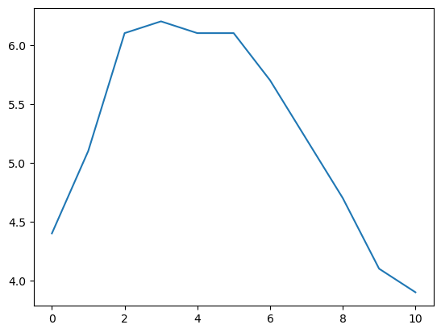

<a href="https://colab.research.google.com/drive/1Ohbu1EgL06hQwXLKyAWvDEJeOnufZ0qD">Abre este Jupyter en Google Colab</a>

# Introducción a Pandas

[Pandas](https://pandas.pydata.org/about/index.html) es una librería que proporciona estructuras de datos y herramientas de análisis de datos de alto rendimiento y fáciles de usar. 
* La estructura de datos principal es el DataFrame, que puede considerarse como una tabla 2D en memoria (como una hoja de cálculo, con nombres de columna y etiquetas de fila). 
* Muchas funciones disponibles en Excel están disponibles mediante programación, como crear tablas dinámicas, calcular columnas basadas en otras columnas, trazar gráficos, etc.
* Proporciona un alto rendimiento para manipular (unir, dividir, modificar…) grandes conjuntos de datos

## Import


```python
# Instalación de Pandas
!pip install pandas
!pip install pyarrow
```

    Requirement already satisfied: pandas in c:\users\josed\anaconda3\lib\site-packages (2.2.2)
    Requirement already satisfied: numpy>=1.26.0 in c:\users\josed\anaconda3\lib\site-packages (from pandas) (1.26.4)
    Requirement already satisfied: python-dateutil>=2.8.2 in c:\users\josed\anaconda3\lib\site-packages (from pandas) (2.9.0.post0)
    Requirement already satisfied: pytz>=2020.1 in c:\users\josed\anaconda3\lib\site-packages (from pandas) (2024.1)
    Requirement already satisfied: tzdata>=2022.7 in c:\users\josed\anaconda3\lib\site-packages (from pandas) (2023.3)
    Requirement already satisfied: six>=1.5 in c:\users\josed\anaconda3\lib\site-packages (from python-dateutil>=2.8.2->pandas) (1.16.0)
    Requirement already satisfied: pyarrow in c:\users\josed\anaconda3\lib\site-packages (14.0.2)
    Requirement already satisfied: numpy>=1.16.6 in c:\users\josed\anaconda3\lib\site-packages (from pyarrow) (1.26.4)
    


```python
import pandas as pd
```

## Estructuras de datos en Pandas

La librería Pandas, de manera genérica, contiene las siguientes estructuras de datos:
* **Series**: Array de una dimensión
* **DataFrame**: Se corresponde con una tabla de 2 dimensiones
* **Panel**: Similar a un diccionario de DataFrames

## Creación del objeto Series


```python
# Creacion de un objeto Series
s = pd.Series([2, 4, 6, 8, 10])
print(s)
```

    0     2
    1     4
    2     6
    3     8
    4    10
    dtype: int64
    


```python
# Creación de un objeto Series inicializándolo con un diccionario de Python
altura = {"Santiago": 187, "Pedro": 178, "Julia": 170, "Ana": 165}
s = pd.Series(altura)
print(s)
```

    Santiago    187
    Pedro       178
    Julia       170
    Ana         165
    dtype: int64
    


```python
# Creación de un objeto Series inicializándolo con algunos 
# de los elementos de un diccionario de Python
altura = {"Santiago": 187, "Pedro": 178, "Julia": 170, "Ana": 165}
s = pd.Series(altura, index = ["Pedro", "Julia"])
print(s)
```

    Pedro    178
    Julia    170
    dtype: int64
    


```python
# Creación de un objeto Series inicializandolo con un escalar
s = pd.Series(34, ["test1", "test2", "test3"])
print(s)
```

    test1    34
    test2    34
    test3    34
    dtype: int64
    

## Acceso a los elementos de un objeto Series

Cada elemento en un objeto Series tiene un identificador único que se denomina **_index label_**.


```python
# Creación de un objeto Series
s = pd.Series([2, 4, 6, 8], index=["num1", "num2", "num3", "num4"])
print(s)
```

    num1    2
    num2    4
    num3    6
    num4    8
    dtype: int64
    


```python
# Accediendo al tercer elemento del objeto
s["num3"]
```


    6


```python
# Tambien se puede acceder al elemento por posición
s[2]
```

    C:\Users\josed\AppData\Local\Temp\ipykernel_4024\360602738.py:2: FutureWarning: Series.__getitem__ treating keys as positions is deprecated. In a future version, integer keys will always be treated as labels (consistent with DataFrame behavior). To access a value by position, use `ser.iloc[pos]`
      s[2]
    


    6


```python
# loc es la forma estándar de acceder a un elemento de un objeto Series por atributo
s.loc["num3"]
```


    6


```python
# iloc es la forma estándar de acceder a un elemento de un objeto Series por posición
s.iloc[2]
```


    6


```python
# Accediendo al segundo y tercer elemento por posición
s.iloc[2:4]
```


    num3    6
    num4    8
    dtype: int64


## Operaciones aritméticas con Series


```python
# Creacion de un objeto Series
s = pd.Series([2, 4, 6, 8, 10])
print(s)
```

    0     2
    1     4
    2     6
    3     8
    4    10
    dtype: int64
    


```python
# Los objeto Series son similares y compatibles con los Arrays de Numpy
import numpy as np
# Ufunc de Numpy para sumar los elementos de un Array
np.sum(s)
```


    30


```python
# El resto de operaciones aritméticas de Numpy sobre Arrays también son posibles
# Más información al respecto en la Introducción a Numpy
s * 2
```


    0     4
    1     8
    2    12
    3    16
    4    20
    dtype: int64


## Representación gráfica de un objeto Series


```python
# Creación de un objeto Series denominado Temperaturas
temperaturas = [4.4, 5.1, 6.1, 6.2, 6.1, 6.1, 5.7, 5.2, 4.7, 4.1, 3.9]
s = pd.Series(temperaturas, name="Temperaturas")
s
```


    0     4.4
    1     5.1
    2     6.1
    3     6.2
    4     6.1
    5     6.1
    6     5.7
    7     5.2
    8     4.7
    9     4.1
    10    3.9
    Name: Temperaturas, dtype: float64


```python
# Representación gráfica del objeto Series
%matplotlib inline
import matplotlib.pyplot as plt

s.plot()
plt.show()
```


    

    


## Creación de un objeto DataFrame


```python
# Creación de un DataFrame inicializándolo con un diccionario de objetios Series
personas = {
    "peso": pd.Series([84, 90, 56, 64], ["Santiago","Pedro", "Ana", "Julia"]),
    "altura": pd.Series({"Santiago": 187, "Pedro": 178, "Julia": 170, "Ana": 165}),
    "hijos": pd.Series([2, 3], ["Pedro", "Julia"])
}

df = pd.DataFrame(personas)
df
```


<div>
<style scoped>
    .dataframe tbody tr th:only-of-type {
        vertical-align: middle;
    }

    .dataframe tbody tr th {
        vertical-align: top;
    }

    .dataframe thead th {
        text-align: right;
    }
</style>
<table border="1" class="dataframe">
  <thead>
    <tr style="text-align: right;">
      <th></th>
      <th>peso</th>
      <th>altura</th>
      <th>hijos</th>
    </tr>
  </thead>
  <tbody>
    <tr>
      <th>Ana</th>
      <td>56</td>
      <td>165</td>
      <td>NaN</td>
    </tr>
    <tr>
      <th>Julia</th>
      <td>64</td>
      <td>170</td>
      <td>3.0</td>
    </tr>
    <tr>
      <th>Pedro</th>
      <td>90</td>
      <td>178</td>
      <td>2.0</td>
    </tr>
    <tr>
      <th>Santiago</th>
      <td>84</td>
      <td>187</td>
      <td>NaN</td>
    </tr>
  </tbody>
</table>
</div>


Puede forzarse al DataFrame a que presente unas columnas determinadas y en un orden determinado


```python
# Creación de un DataFrame inicializándolo con algunos elementos de un diccionario
# de objetos Series
personas = {
    "peso": pd.Series([84, 90, 56, 64], ["Santiago","Pedro", "Ana", "Julia"]),
    "altura": pd.Series({"Santiago": 187, "Pedro": 178, "Julia": 170, "Ana": 165}),
    "hijos": pd.Series([2, 3], ["Pedro", "Julia"])
}

df = pd.DataFrame(
        personas,
        columns = ["altura", "peso"],
        index = ["Ana", "Julia", "Santiago"])
df
```


<div>
<style scoped>
    .dataframe tbody tr th:only-of-type {
        vertical-align: middle;
    }

    .dataframe tbody tr th {
        vertical-align: top;
    }

    .dataframe thead th {
        text-align: right;
    }
</style>
<table border="1" class="dataframe">
  <thead>
    <tr style="text-align: right;">
      <th></th>
      <th>altura</th>
      <th>peso</th>
    </tr>
  </thead>
  <tbody>
    <tr>
      <th>Ana</th>
      <td>165</td>
      <td>56</td>
    </tr>
    <tr>
      <th>Julia</th>
      <td>170</td>
      <td>64</td>
    </tr>
    <tr>
      <th>Santiago</th>
      <td>187</td>
      <td>84</td>
    </tr>
  </tbody>
</table>
</div>


```python
# Creación de un DataFrame inicializándolo con una lista de listas de Python
# Importante: Deben especificarse las columnas e indices por separado
valores = [
    [185, 4, 76],
    [170, 0, 65],
    [190, 1, 89]
]

df = pd.DataFrame(
        valores,
        columns = ["altura", "hijos", "peso"],
        index = ["Pedro", "Ana", "Juan"])
df
```


<div>
<style scoped>
    .dataframe tbody tr th:only-of-type {
        vertical-align: middle;
    }

    .dataframe tbody tr th {
        vertical-align: top;
    }

    .dataframe thead th {
        text-align: right;
    }
</style>
<table border="1" class="dataframe">
  <thead>
    <tr style="text-align: right;">
      <th></th>
      <th>altura</th>
      <th>hijos</th>
      <th>peso</th>
    </tr>
  </thead>
  <tbody>
    <tr>
      <th>Pedro</th>
      <td>185</td>
      <td>4</td>
      <td>76</td>
    </tr>
    <tr>
      <th>Ana</th>
      <td>170</td>
      <td>0</td>
      <td>65</td>
    </tr>
    <tr>
      <th>Juan</th>
      <td>190</td>
      <td>1</td>
      <td>89</td>
    </tr>
  </tbody>
</table>
</div>


```python
# Creación de un DataFrame inicializándolo con un diccionario de Python
personas = {
    "altura": {"Santiago": 187, "Pedro": 178, "Julia": 170, "Ana": 165}, 
    "peso": {"Santiago": 87, "Pedro": 78, "Julia": 70, "Ana": 65}}

df = pd.DataFrame(personas)
df
```


<div>
<style scoped>
    .dataframe tbody tr th:only-of-type {
        vertical-align: middle;
    }

    .dataframe tbody tr th {
        vertical-align: top;
    }

    .dataframe thead th {
        text-align: right;
    }
</style>
<table border="1" class="dataframe">
  <thead>
    <tr style="text-align: right;">
      <th></th>
      <th>altura</th>
      <th>peso</th>
    </tr>
  </thead>
  <tbody>
    <tr>
      <th>Santiago</th>
      <td>187</td>
      <td>87</td>
    </tr>
    <tr>
      <th>Pedro</th>
      <td>178</td>
      <td>78</td>
    </tr>
    <tr>
      <th>Julia</th>
      <td>170</td>
      <td>70</td>
    </tr>
    <tr>
      <th>Ana</th>
      <td>165</td>
      <td>65</td>
    </tr>
  </tbody>
</table>
</div>


## Acceso a los elementos de un DataFrame


```python
# Creación de un DataFrame inicializándolo con un diccionario de objetios Series
personas = {
    "peso": pd.Series([84, 90, 56, 64], ["Santiago","Pedro", "Ana", "Julia"]),
    "altura": pd.Series({"Santiago": 187, "Pedro": 178, "Julia": 170, "Ana": 165}),
    "hijos": pd.Series([2, 3], ["Pedro", "Julia"])
}

df = pd.DataFrame(personas)
df
```


<div>
<style scoped>
    .dataframe tbody tr th:only-of-type {
        vertical-align: middle;
    }

    .dataframe tbody tr th {
        vertical-align: top;
    }

    .dataframe thead th {
        text-align: right;
    }
</style>
<table border="1" class="dataframe">
  <thead>
    <tr style="text-align: right;">
      <th></th>
      <th>peso</th>
      <th>altura</th>
      <th>hijos</th>
    </tr>
  </thead>
  <tbody>
    <tr>
      <th>Ana</th>
      <td>56</td>
      <td>165</td>
      <td>NaN</td>
    </tr>
    <tr>
      <th>Julia</th>
      <td>64</td>
      <td>170</td>
      <td>3.0</td>
    </tr>
    <tr>
      <th>Pedro</th>
      <td>90</td>
      <td>178</td>
      <td>2.0</td>
    </tr>
    <tr>
      <th>Santiago</th>
      <td>84</td>
      <td>187</td>
      <td>NaN</td>
    </tr>
  </tbody>
</table>
</div>


### Acceso a los elementos de las columnas del DataFrame


```python
df["peso"]
```


    Ana         56
    Julia       64
    Pedro       90
    Santiago    84
    Name: peso, dtype: int64


```python
df[["peso", "altura"]]
```


<div>
<style scoped>
    .dataframe tbody tr th:only-of-type {
        vertical-align: middle;
    }

    .dataframe tbody tr th {
        vertical-align: top;
    }

    .dataframe thead th {
        text-align: right;
    }
</style>
<table border="1" class="dataframe">
  <thead>
    <tr style="text-align: right;">
      <th></th>
      <th>peso</th>
      <th>altura</th>
    </tr>
  </thead>
  <tbody>
    <tr>
      <th>Ana</th>
      <td>56</td>
      <td>165</td>
    </tr>
    <tr>
      <th>Julia</th>
      <td>64</td>
      <td>170</td>
    </tr>
    <tr>
      <th>Pedro</th>
      <td>90</td>
      <td>178</td>
    </tr>
    <tr>
      <th>Santiago</th>
      <td>84</td>
      <td>187</td>
    </tr>
  </tbody>
</table>
</div>


```python
# Pueden combinarse los metodos anteriores con expresiones booleanas
df["peso"] > 80
```


    Ana         False
    Julia       False
    Pedro        True
    Santiago     True
    Name: peso, dtype: bool


```python
# Pueden combinarse los metodos anteriores con expresiones booleanas
df[(df["peso"] > 80) & (df["altura"] > 180)]
```


<div>
<style scoped>
    .dataframe tbody tr th:only-of-type {
        vertical-align: middle;
    }

    .dataframe tbody tr th {
        vertical-align: top;
    }

    .dataframe thead th {
        text-align: right;
    }
</style>
<table border="1" class="dataframe">
  <thead>
    <tr style="text-align: right;">
      <th></th>
      <th>peso</th>
      <th>altura</th>
      <th>hijos</th>
    </tr>
  </thead>
  <tbody>
    <tr>
      <th>Santiago</th>
      <td>84</td>
      <td>187</td>
      <td>NaN</td>
    </tr>
  </tbody>
</table>
</div>


### Acceso a los elementos de las filas del DataFrame


```python
# Mostrar el DataFrame
df
```


<div>
<style scoped>
    .dataframe tbody tr th:only-of-type {
        vertical-align: middle;
    }

    .dataframe tbody tr th {
        vertical-align: top;
    }

    .dataframe thead th {
        text-align: right;
    }
</style>
<table border="1" class="dataframe">
  <thead>
    <tr style="text-align: right;">
      <th></th>
      <th>peso</th>
      <th>altura</th>
      <th>hijos</th>
    </tr>
  </thead>
  <tbody>
    <tr>
      <th>Ana</th>
      <td>56</td>
      <td>165</td>
      <td>NaN</td>
    </tr>
    <tr>
      <th>Julia</th>
      <td>64</td>
      <td>170</td>
      <td>3.0</td>
    </tr>
    <tr>
      <th>Pedro</th>
      <td>90</td>
      <td>178</td>
      <td>2.0</td>
    </tr>
    <tr>
      <th>Santiago</th>
      <td>84</td>
      <td>187</td>
      <td>NaN</td>
    </tr>
  </tbody>
</table>
</div>


```python
df.loc["Pedro"]
```


    peso       90.0
    altura    178.0
    hijos       2.0
    Name: Pedro, dtype: float64


```python
df.iloc[2]
```


    peso       90.0
    altura    178.0
    hijos       2.0
    Name: Pedro, dtype: float64


```python
df.iloc[1:3]
```


<div>
<style scoped>
    .dataframe tbody tr th:only-of-type {
        vertical-align: middle;
    }

    .dataframe tbody tr th {
        vertical-align: top;
    }

    .dataframe thead th {
        text-align: right;
    }
</style>
<table border="1" class="dataframe">
  <thead>
    <tr style="text-align: right;">
      <th></th>
      <th>peso</th>
      <th>altura</th>
      <th>hijos</th>
    </tr>
  </thead>
  <tbody>
    <tr>
      <th>Julia</th>
      <td>64</td>
      <td>170</td>
      <td>3.0</td>
    </tr>
    <tr>
      <th>Pedro</th>
      <td>90</td>
      <td>178</td>
      <td>2.0</td>
    </tr>
  </tbody>
</table>
</div>


### Consulta avanzada de los elementos de un DataFrame


```python
# Mostrar el DataFrame
df
```


<div>
<style scoped>
    .dataframe tbody tr th:only-of-type {
        vertical-align: middle;
    }

    .dataframe tbody tr th {
        vertical-align: top;
    }

    .dataframe thead th {
        text-align: right;
    }
</style>
<table border="1" class="dataframe">
  <thead>
    <tr style="text-align: right;">
      <th></th>
      <th>peso</th>
      <th>altura</th>
      <th>hijos</th>
    </tr>
  </thead>
  <tbody>
    <tr>
      <th>Ana</th>
      <td>56</td>
      <td>165</td>
      <td>NaN</td>
    </tr>
    <tr>
      <th>Julia</th>
      <td>64</td>
      <td>170</td>
      <td>3.0</td>
    </tr>
    <tr>
      <th>Pedro</th>
      <td>90</td>
      <td>178</td>
      <td>2.0</td>
    </tr>
    <tr>
      <th>Santiago</th>
      <td>84</td>
      <td>187</td>
      <td>NaN</td>
    </tr>
  </tbody>
</table>
</div>


```python
df.query("altura >= 170 and peso > 60")
```


<div>
<style scoped>
    .dataframe tbody tr th:only-of-type {
        vertical-align: middle;
    }

    .dataframe tbody tr th {
        vertical-align: top;
    }

    .dataframe thead th {
        text-align: right;
    }
</style>
<table border="1" class="dataframe">
  <thead>
    <tr style="text-align: right;">
      <th></th>
      <th>peso</th>
      <th>altura</th>
      <th>hijos</th>
    </tr>
  </thead>
  <tbody>
    <tr>
      <th>Julia</th>
      <td>64</td>
      <td>170</td>
      <td>3.0</td>
    </tr>
    <tr>
      <th>Pedro</th>
      <td>90</td>
      <td>178</td>
      <td>2.0</td>
    </tr>
    <tr>
      <th>Santiago</th>
      <td>84</td>
      <td>187</td>
      <td>NaN</td>
    </tr>
  </tbody>
</table>
</div>


## Copiar un DataFrame


```python
# Creación de un DataFrame inicializándolo con un diccionario de objetios Series
personas = {
    "peso": pd.Series([84, 90, 56, 64], ["Santiago","Pedro", "Ana", "Julia"]),
    "altura": pd.Series({"Santiago": 187, "Pedro": 178, "Julia": 170, "Ana": 165}),
    "hijos": pd.Series([2, 3], ["Pedro", "Julia"])
}

df = pd.DataFrame(personas)
df
```


<div>
<style scoped>
    .dataframe tbody tr th:only-of-type {
        vertical-align: middle;
    }

    .dataframe tbody tr th {
        vertical-align: top;
    }

    .dataframe thead th {
        text-align: right;
    }
</style>
<table border="1" class="dataframe">
  <thead>
    <tr style="text-align: right;">
      <th></th>
      <th>peso</th>
      <th>altura</th>
      <th>hijos</th>
    </tr>
  </thead>
  <tbody>
    <tr>
      <th>Ana</th>
      <td>56</td>
      <td>165</td>
      <td>NaN</td>
    </tr>
    <tr>
      <th>Julia</th>
      <td>64</td>
      <td>170</td>
      <td>3.0</td>
    </tr>
    <tr>
      <th>Pedro</th>
      <td>90</td>
      <td>178</td>
      <td>2.0</td>
    </tr>
    <tr>
      <th>Santiago</th>
      <td>84</td>
      <td>187</td>
      <td>NaN</td>
    </tr>
  </tbody>
</table>
</div>


```python
# Copia del DataFrame df en df_copy
# Importante: Al modificar un elemento de df_copy no se modifica df
df_copy = df.copy()
```

## Modificación de un DataFrame


```python
# Creación de un DataFrame inicializándolo con un diccionario de objetios Series
personas = {
    "peso": pd.Series([84, 90, 56, 64], ["Santiago","Pedro", "Ana", "Julia"]),
    "altura": pd.Series({"Santiago": 187, "Pedro": 178, "Julia": 170, "Ana": 165}),
    "hijos": pd.Series([2, 3], ["Pedro", "Julia"])
}

df = pd.DataFrame(personas)
df
```


<div>
<style scoped>
    .dataframe tbody tr th:only-of-type {
        vertical-align: middle;
    }

    .dataframe tbody tr th {
        vertical-align: top;
    }

    .dataframe thead th {
        text-align: right;
    }
</style>
<table border="1" class="dataframe">
  <thead>
    <tr style="text-align: right;">
      <th></th>
      <th>peso</th>
      <th>altura</th>
      <th>hijos</th>
    </tr>
  </thead>
  <tbody>
    <tr>
      <th>Ana</th>
      <td>56</td>
      <td>165</td>
      <td>NaN</td>
    </tr>
    <tr>
      <th>Julia</th>
      <td>64</td>
      <td>170</td>
      <td>3.0</td>
    </tr>
    <tr>
      <th>Pedro</th>
      <td>90</td>
      <td>178</td>
      <td>2.0</td>
    </tr>
    <tr>
      <th>Santiago</th>
      <td>84</td>
      <td>187</td>
      <td>NaN</td>
    </tr>
  </tbody>
</table>
</div>


```python
# Añadir una nueva columna al DataFrame
df["cumpleaños"] = [1990, 1987, 1980, 1994]
df
```


<div>
<style scoped>
    .dataframe tbody tr th:only-of-type {
        vertical-align: middle;
    }

    .dataframe tbody tr th {
        vertical-align: top;
    }

    .dataframe thead th {
        text-align: right;
    }
</style>
<table border="1" class="dataframe">
  <thead>
    <tr style="text-align: right;">
      <th></th>
      <th>peso</th>
      <th>altura</th>
      <th>hijos</th>
      <th>cumpleaños</th>
    </tr>
  </thead>
  <tbody>
    <tr>
      <th>Ana</th>
      <td>56</td>
      <td>165</td>
      <td>NaN</td>
      <td>1990</td>
    </tr>
    <tr>
      <th>Julia</th>
      <td>64</td>
      <td>170</td>
      <td>3.0</td>
      <td>1987</td>
    </tr>
    <tr>
      <th>Pedro</th>
      <td>90</td>
      <td>178</td>
      <td>2.0</td>
      <td>1980</td>
    </tr>
    <tr>
      <th>Santiago</th>
      <td>84</td>
      <td>187</td>
      <td>NaN</td>
      <td>1994</td>
    </tr>
  </tbody>
</table>
</div>


```python
# Añadir una nueva columna calculada al DataFrame
df["años"] = 2020 - df["cumpleaños"]
df
```


<div>
<style scoped>
    .dataframe tbody tr th:only-of-type {
        vertical-align: middle;
    }

    .dataframe tbody tr th {
        vertical-align: top;
    }

    .dataframe thead th {
        text-align: right;
    }
</style>
<table border="1" class="dataframe">
  <thead>
    <tr style="text-align: right;">
      <th></th>
      <th>peso</th>
      <th>altura</th>
      <th>hijos</th>
      <th>cumpleaños</th>
      <th>años</th>
    </tr>
  </thead>
  <tbody>
    <tr>
      <th>Ana</th>
      <td>56</td>
      <td>165</td>
      <td>NaN</td>
      <td>1990</td>
      <td>30</td>
    </tr>
    <tr>
      <th>Julia</th>
      <td>64</td>
      <td>170</td>
      <td>3.0</td>
      <td>1987</td>
      <td>33</td>
    </tr>
    <tr>
      <th>Pedro</th>
      <td>90</td>
      <td>178</td>
      <td>2.0</td>
      <td>1980</td>
      <td>40</td>
    </tr>
    <tr>
      <th>Santiago</th>
      <td>84</td>
      <td>187</td>
      <td>NaN</td>
      <td>1994</td>
      <td>26</td>
    </tr>
  </tbody>
</table>
</div>


```python
# Añadir una nueva columna creando un DataFrame nuevo
df_mod = df.assign(mascotas = [1, 3, 0, 0])
df_mod
```


<div>
<style scoped>
    .dataframe tbody tr th:only-of-type {
        vertical-align: middle;
    }

    .dataframe tbody tr th {
        vertical-align: top;
    }

    .dataframe thead th {
        text-align: right;
    }
</style>
<table border="1" class="dataframe">
  <thead>
    <tr style="text-align: right;">
      <th></th>
      <th>peso</th>
      <th>altura</th>
      <th>hijos</th>
      <th>cumpleaños</th>
      <th>años</th>
      <th>mascotas</th>
    </tr>
  </thead>
  <tbody>
    <tr>
      <th>Ana</th>
      <td>56</td>
      <td>165</td>
      <td>NaN</td>
      <td>1990</td>
      <td>30</td>
      <td>1</td>
    </tr>
    <tr>
      <th>Julia</th>
      <td>64</td>
      <td>170</td>
      <td>3.0</td>
      <td>1987</td>
      <td>33</td>
      <td>3</td>
    </tr>
    <tr>
      <th>Pedro</th>
      <td>90</td>
      <td>178</td>
      <td>2.0</td>
      <td>1980</td>
      <td>40</td>
      <td>0</td>
    </tr>
    <tr>
      <th>Santiago</th>
      <td>84</td>
      <td>187</td>
      <td>NaN</td>
      <td>1994</td>
      <td>26</td>
      <td>0</td>
    </tr>
  </tbody>
</table>
</div>


```python
df
```


<div>
<style scoped>
    .dataframe tbody tr th:only-of-type {
        vertical-align: middle;
    }

    .dataframe tbody tr th {
        vertical-align: top;
    }

    .dataframe thead th {
        text-align: right;
    }
</style>
<table border="1" class="dataframe">
  <thead>
    <tr style="text-align: right;">
      <th></th>
      <th>peso</th>
      <th>altura</th>
      <th>hijos</th>
      <th>cumpleaños</th>
      <th>años</th>
    </tr>
  </thead>
  <tbody>
    <tr>
      <th>Ana</th>
      <td>56</td>
      <td>165</td>
      <td>NaN</td>
      <td>1990</td>
      <td>30</td>
    </tr>
    <tr>
      <th>Julia</th>
      <td>64</td>
      <td>170</td>
      <td>3.0</td>
      <td>1987</td>
      <td>33</td>
    </tr>
    <tr>
      <th>Pedro</th>
      <td>90</td>
      <td>178</td>
      <td>2.0</td>
      <td>1980</td>
      <td>40</td>
    </tr>
    <tr>
      <th>Santiago</th>
      <td>84</td>
      <td>187</td>
      <td>NaN</td>
      <td>1994</td>
      <td>26</td>
    </tr>
  </tbody>
</table>
</div>


```python
# Eliminar una columna existente del DataFrame
del df["peso"]
df
```


<div>
<style scoped>
    .dataframe tbody tr th:only-of-type {
        vertical-align: middle;
    }

    .dataframe tbody tr th {
        vertical-align: top;
    }

    .dataframe thead th {
        text-align: right;
    }
</style>
<table border="1" class="dataframe">
  <thead>
    <tr style="text-align: right;">
      <th></th>
      <th>altura</th>
      <th>hijos</th>
      <th>cumpleaños</th>
      <th>años</th>
    </tr>
  </thead>
  <tbody>
    <tr>
      <th>Ana</th>
      <td>165</td>
      <td>NaN</td>
      <td>1990</td>
      <td>30</td>
    </tr>
    <tr>
      <th>Julia</th>
      <td>170</td>
      <td>3.0</td>
      <td>1987</td>
      <td>33</td>
    </tr>
    <tr>
      <th>Pedro</th>
      <td>178</td>
      <td>2.0</td>
      <td>1980</td>
      <td>40</td>
    </tr>
    <tr>
      <th>Santiago</th>
      <td>187</td>
      <td>NaN</td>
      <td>1994</td>
      <td>26</td>
    </tr>
  </tbody>
</table>
</div>


```python
# Eliminar una columna existente devolviendo una copia del DataFrame resultante
df_mod = df.drop(["hijos"], axis=1)
df_mod
```


<div>
<style scoped>
    .dataframe tbody tr th:only-of-type {
        vertical-align: middle;
    }

    .dataframe tbody tr th {
        vertical-align: top;
    }

    .dataframe thead th {
        text-align: right;
    }
</style>
<table border="1" class="dataframe">
  <thead>
    <tr style="text-align: right;">
      <th></th>
      <th>altura</th>
      <th>cumpleaños</th>
      <th>años</th>
    </tr>
  </thead>
  <tbody>
    <tr>
      <th>Ana</th>
      <td>165</td>
      <td>1990</td>
      <td>30</td>
    </tr>
    <tr>
      <th>Julia</th>
      <td>170</td>
      <td>1987</td>
      <td>33</td>
    </tr>
    <tr>
      <th>Pedro</th>
      <td>178</td>
      <td>1980</td>
      <td>40</td>
    </tr>
    <tr>
      <th>Santiago</th>
      <td>187</td>
      <td>1994</td>
      <td>26</td>
    </tr>
  </tbody>
</table>
</div>


```python
df
```


<div>
<style scoped>
    .dataframe tbody tr th:only-of-type {
        vertical-align: middle;
    }

    .dataframe tbody tr th {
        vertical-align: top;
    }

    .dataframe thead th {
        text-align: right;
    }
</style>
<table border="1" class="dataframe">
  <thead>
    <tr style="text-align: right;">
      <th></th>
      <th>altura</th>
      <th>hijos</th>
      <th>cumpleaños</th>
      <th>años</th>
    </tr>
  </thead>
  <tbody>
    <tr>
      <th>Ana</th>
      <td>165</td>
      <td>NaN</td>
      <td>1990</td>
      <td>30</td>
    </tr>
    <tr>
      <th>Julia</th>
      <td>170</td>
      <td>3.0</td>
      <td>1987</td>
      <td>33</td>
    </tr>
    <tr>
      <th>Pedro</th>
      <td>178</td>
      <td>2.0</td>
      <td>1980</td>
      <td>40</td>
    </tr>
    <tr>
      <th>Santiago</th>
      <td>187</td>
      <td>NaN</td>
      <td>1994</td>
      <td>26</td>
    </tr>
  </tbody>
</table>
</div>


## Evaluación de expresiones sobre un DataFrame


```python
# Creación de un DataFrame inicializándolo con un diccionario de objetios Series
personas = {
    "peso": pd.Series([84, 90, 56, 64], ["Santiago","Pedro", "Ana", "Julia"]),
    "altura": pd.Series({"Santiago": 187, "Pedro": 178, "Julia": 170, "Ana": 165}),
    "hijos": pd.Series([2, 3], ["Pedro", "Julia"])
}

df = pd.DataFrame(personas)
df
```


<div>
<style scoped>
    .dataframe tbody tr th:only-of-type {
        vertical-align: middle;
    }

    .dataframe tbody tr th {
        vertical-align: top;
    }

    .dataframe thead th {
        text-align: right;
    }
</style>
<table border="1" class="dataframe">
  <thead>
    <tr style="text-align: right;">
      <th></th>
      <th>peso</th>
      <th>altura</th>
      <th>hijos</th>
    </tr>
  </thead>
  <tbody>
    <tr>
      <th>Ana</th>
      <td>56</td>
      <td>165</td>
      <td>NaN</td>
    </tr>
    <tr>
      <th>Julia</th>
      <td>64</td>
      <td>170</td>
      <td>3.0</td>
    </tr>
    <tr>
      <th>Pedro</th>
      <td>90</td>
      <td>178</td>
      <td>2.0</td>
    </tr>
    <tr>
      <th>Santiago</th>
      <td>84</td>
      <td>187</td>
      <td>NaN</td>
    </tr>
  </tbody>
</table>
</div>


```python
# Evaluar una función sobre una columna del DataFrame
df.eval("altura / 2")
```


    Ana         82.5
    Julia       85.0
    Pedro       89.0
    Santiago    93.5
    dtype: float64


```python
# Asignar el valor resultante como una nueva columna
df.eval("media_altura = altura / 2", inplace=True)
df
```


<div>
<style scoped>
    .dataframe tbody tr th:only-of-type {
        vertical-align: middle;
    }

    .dataframe tbody tr th {
        vertical-align: top;
    }

    .dataframe thead th {
        text-align: right;
    }
</style>
<table border="1" class="dataframe">
  <thead>
    <tr style="text-align: right;">
      <th></th>
      <th>peso</th>
      <th>altura</th>
      <th>hijos</th>
      <th>media_altura</th>
    </tr>
  </thead>
  <tbody>
    <tr>
      <th>Ana</th>
      <td>56</td>
      <td>165</td>
      <td>NaN</td>
      <td>82.5</td>
    </tr>
    <tr>
      <th>Julia</th>
      <td>64</td>
      <td>170</td>
      <td>3.0</td>
      <td>85.0</td>
    </tr>
    <tr>
      <th>Pedro</th>
      <td>90</td>
      <td>178</td>
      <td>2.0</td>
      <td>89.0</td>
    </tr>
    <tr>
      <th>Santiago</th>
      <td>84</td>
      <td>187</td>
      <td>NaN</td>
      <td>93.5</td>
    </tr>
  </tbody>
</table>
</div>


```python
# Evaluar una función utilizando una variable local
max_altura = 180
df.eval("altura > @max_altura")
```


    Ana         False
    Julia       False
    Pedro       False
    Santiago     True
    dtype: bool


```python
# Aplicar una función externa a una columna del DataFrame
def func(x):
    return x + 2

df["peso"].apply(func)
```


    Ana         58
    Julia       66
    Pedro       92
    Santiago    86
    Name: peso, dtype: int64


```python
df
```


<div>
<style scoped>
    .dataframe tbody tr th:only-of-type {
        vertical-align: middle;
    }

    .dataframe tbody tr th {
        vertical-align: top;
    }

    .dataframe thead th {
        text-align: right;
    }
</style>
<table border="1" class="dataframe">
  <thead>
    <tr style="text-align: right;">
      <th></th>
      <th>peso</th>
      <th>altura</th>
      <th>hijos</th>
      <th>media_altura</th>
    </tr>
  </thead>
  <tbody>
    <tr>
      <th>Ana</th>
      <td>56</td>
      <td>165</td>
      <td>NaN</td>
      <td>82.5</td>
    </tr>
    <tr>
      <th>Julia</th>
      <td>64</td>
      <td>170</td>
      <td>3.0</td>
      <td>85.0</td>
    </tr>
    <tr>
      <th>Pedro</th>
      <td>90</td>
      <td>178</td>
      <td>2.0</td>
      <td>89.0</td>
    </tr>
    <tr>
      <th>Santiago</th>
      <td>84</td>
      <td>187</td>
      <td>NaN</td>
      <td>93.5</td>
    </tr>
  </tbody>
</table>
</div>


## Guardar y Cargar el DataFrame


```python
# Creación de un DataFrame inicializándolo con un diccionario de objetios Series
personas = {
    "peso": pd.Series([84, 90, 56, 64], ["Santiago","Pedro", "Ana", "Julia"]),
    "altura": pd.Series({"Santiago": 187, "Pedro": 178, "Julia": 170, "Ana": 165}),
    "hijos": pd.Series([2, 3], ["Pedro", "Julia"])
}

df = pd.DataFrame(personas)
df
```


<div>
<style scoped>
    .dataframe tbody tr th:only-of-type {
        vertical-align: middle;
    }

    .dataframe tbody tr th {
        vertical-align: top;
    }

    .dataframe thead th {
        text-align: right;
    }
</style>
<table border="1" class="dataframe">
  <thead>
    <tr style="text-align: right;">
      <th></th>
      <th>peso</th>
      <th>altura</th>
      <th>hijos</th>
    </tr>
  </thead>
  <tbody>
    <tr>
      <th>Ana</th>
      <td>56</td>
      <td>165</td>
      <td>NaN</td>
    </tr>
    <tr>
      <th>Julia</th>
      <td>64</td>
      <td>170</td>
      <td>3.0</td>
    </tr>
    <tr>
      <th>Pedro</th>
      <td>90</td>
      <td>178</td>
      <td>2.0</td>
    </tr>
    <tr>
      <th>Santiago</th>
      <td>84</td>
      <td>187</td>
      <td>NaN</td>
    </tr>
  </tbody>
</table>
</div>


```python
# Guardar el DataFrame como CSV, HTML y JSON
df.to_csv("df_personas.csv")
df.to_html("df_personas.html")
df.to_json("df_personas.json")
```


```python
# Cargar el DataFrame en Jupyter
df2 = pd.read_csv("df_personas.csv")
```


```python
df2
```


<div>
<style scoped>
    .dataframe tbody tr th:only-of-type {
        vertical-align: middle;
    }

    .dataframe tbody tr th {
        vertical-align: top;
    }

    .dataframe thead th {
        text-align: right;
    }
</style>
<table border="1" class="dataframe">
  <thead>
    <tr style="text-align: right;">
      <th></th>
      <th>Unnamed: 0</th>
      <th>peso</th>
      <th>altura</th>
      <th>hijos</th>
    </tr>
  </thead>
  <tbody>
    <tr>
      <th>0</th>
      <td>Ana</td>
      <td>56</td>
      <td>165</td>
      <td>NaN</td>
    </tr>
    <tr>
      <th>1</th>
      <td>Julia</td>
      <td>64</td>
      <td>170</td>
      <td>3.0</td>
    </tr>
    <tr>
      <th>2</th>
      <td>Pedro</td>
      <td>90</td>
      <td>178</td>
      <td>2.0</td>
    </tr>
    <tr>
      <th>3</th>
      <td>Santiago</td>
      <td>84</td>
      <td>187</td>
      <td>NaN</td>
    </tr>
  </tbody>
</table>
</div>


```python
# Cargar el DataFrame con la primera columna correctamente asignada
df2 = pd.read_csv("df_personas.csv", index_col=0)
df2
```


<div>
<style scoped>
    .dataframe tbody tr th:only-of-type {
        vertical-align: middle;
    }

    .dataframe tbody tr th {
        vertical-align: top;
    }

    .dataframe thead th {
        text-align: right;
    }
</style>
<table border="1" class="dataframe">
  <thead>
    <tr style="text-align: right;">
      <th></th>
      <th>peso</th>
      <th>altura</th>
      <th>hijos</th>
    </tr>
  </thead>
  <tbody>
    <tr>
      <th>Ana</th>
      <td>56</td>
      <td>165</td>
      <td>NaN</td>
    </tr>
    <tr>
      <th>Julia</th>
      <td>64</td>
      <td>170</td>
      <td>3.0</td>
    </tr>
    <tr>
      <th>Pedro</th>
      <td>90</td>
      <td>178</td>
      <td>2.0</td>
    </tr>
    <tr>
      <th>Santiago</th>
      <td>84</td>
      <td>187</td>
      <td>NaN</td>
    </tr>
  </tbody>
</table>
</div>


