<a href="https://colab.research.google.com/drive/1o1v1RQEVcd3KNveDml3s2Zbz-8dX2P-k">Abre este Jupyter en Google Colab</a>

# Introducción a Matplotlib

[Matplotlib](https://matplotlib.org) es una librería que permite la creación de figuras y gráficos de calidad mediante el uso de Python.
* Permite la creación de gráficos de manera sencilla y eficiente
* Permite la integración de gráficos y figuras en un Jupyter Notebook

## Import


```python
# Instalación de matplotlib
!pip install matplotlib
```

    Requirement already satisfied: matplotlib in c:\users\josed\anaconda3\envs\cursomachinelearningudemy\lib\site-packages (3.9.0)
    Requirement already satisfied: contourpy>=1.0.1 in c:\users\josed\anaconda3\envs\cursomachinelearningudemy\lib\site-packages (from matplotlib) (1.2.1)
    Requirement already satisfied: cycler>=0.10 in c:\users\josed\anaconda3\envs\cursomachinelearningudemy\lib\site-packages (from matplotlib) (0.12.1)
    Requirement already satisfied: fonttools>=4.22.0 in c:\users\josed\anaconda3\envs\cursomachinelearningudemy\lib\site-packages (from matplotlib) (4.53.1)
    Requirement already satisfied: kiwisolver>=1.3.1 in c:\users\josed\anaconda3\envs\cursomachinelearningudemy\lib\site-packages (from matplotlib) (1.4.5)
    Requirement already satisfied: numpy>=1.23 in c:\users\josed\anaconda3\envs\cursomachinelearningudemy\lib\site-packages (from matplotlib) (2.0.1)
    Requirement already satisfied: packaging>=20.0 in c:\users\josed\anaconda3\envs\cursomachinelearningudemy\lib\site-packages (from matplotlib) (24.1)
    Requirement already satisfied: pillow>=8 in c:\users\josed\anaconda3\envs\cursomachinelearningudemy\lib\site-packages (from matplotlib) (10.4.0)
    Requirement already satisfied: pyparsing>=2.3.1 in c:\users\josed\anaconda3\envs\cursomachinelearningudemy\lib\site-packages (from matplotlib) (3.1.2)
    Requirement already satisfied: python-dateutil>=2.7 in c:\users\josed\anaconda3\envs\cursomachinelearningudemy\lib\site-packages (from matplotlib) (2.9.0.post0)
    Requirement already satisfied: six>=1.5 in c:\users\josed\anaconda3\envs\cursomachinelearningudemy\lib\site-packages (from python-dateutil>=2.7->matplotlib) (1.16.0)
    


```python
import matplotlib
import matplotlib.pyplot as plt
```


```python
# Muestrar los gráficos integrados dentro de jupyter notebook
%matplotlib inline
```

## Representación gráfica de datos

Si a la función de trazado se le da una matriz de datos, la usará como coordenadas en el eje vertical, y utilizará el índice de cada punto de datos en el array como la coordenada horizontal.


```python
plt.plot([1, 2, 5, 7, 8, 3, 1])
plt.show()
```


    
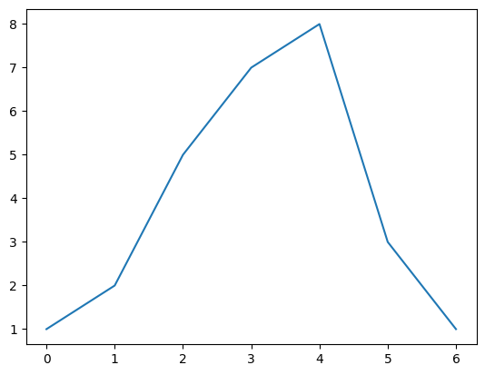
    


También se puede proporcionar dos matrices: una para el eje horizontal, y otra para el eje vertical.


```python
plt.plot([-3, -1, 0, 4, 7], [1, 4, 6, 7, 8])
plt.show()
```


    
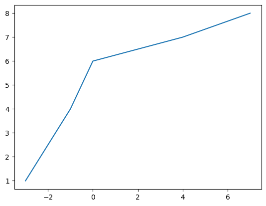
    


Pueden modificarse las logitudes de los ejes para que la figura no se vea tan ajustada


```python
plt.plot([-3, -1, 0, 4, 7], [1, 4, 6, 7, 8])
plt.axis([-4, 8, 0, 10]) # [xmin, xmax, ymin, ymax]
plt.show()
```


    
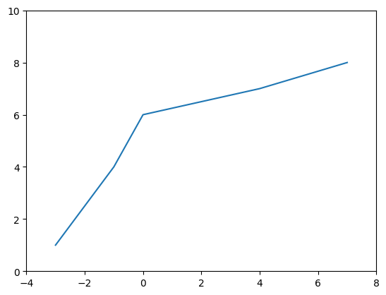
    


Se sigue el mismo procedimiento para pintar una función matemática


```python
import numpy as np
x = np.linspace(-2, 2, 500)
y = x**2

plt.plot(x, y)
plt.show()
```


    
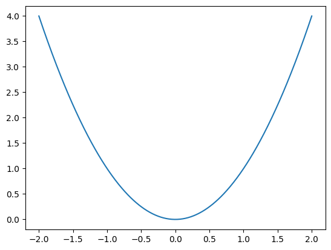
    


También pude modificarse el estilo de la gráfica para que contenga más información.


```python
plt.plot(x, y)
plt.title("Square function")
plt.xlabel("x")
plt.ylabel("y = x**2")
plt.grid(True)
plt.show()
```


    
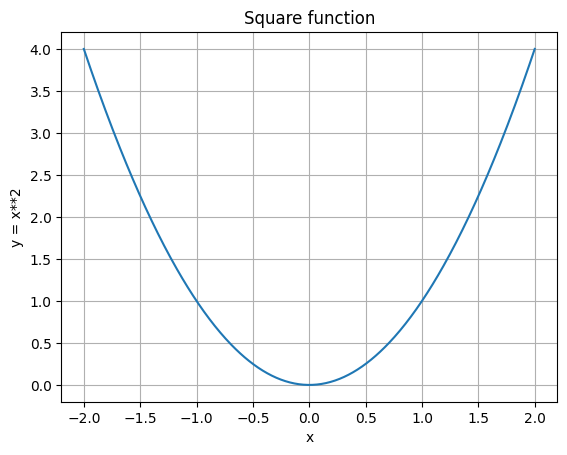
    


Pueden superponerse gráficas y cambiar el estilo de las líneas


```python
import numpy as np
x = np.linspace(-2, 2, 500)
y = x**2
y2 = x + 1

plt.plot(x, y, 'b--', x, y2, 'g')
plt.show()
```


    
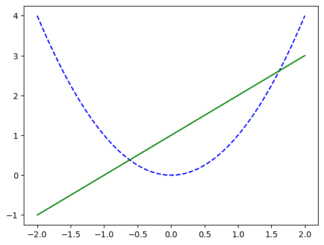
    


```python
# Separando en diferentes lineas las funciones
import numpy as np
x = np.linspace(-2, 2, 500)
y = x**2
y2 = x + 1

plt.plot(x, y, 'b--')
plt.plot(x, y2, 'g')
plt.show()
```


    

    


Para poder diferenciar entre ambas funciones siempre es recomendable añadir una leyenda


```python
import numpy as np
x = np.linspace(-2, 2, 500)
y = x**2
y2 = x + 1

plt.plot(x, y, 'b--', label="x**2")
plt.plot(x, y2, 'g', label="x+1")
plt.legend(loc="best") # La situa en la mejor localización
plt.show()
```


    
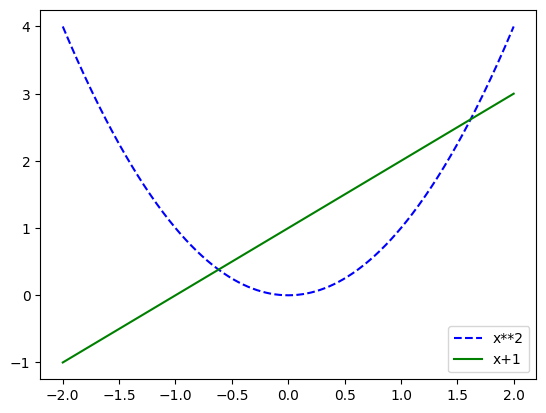
    


Tambien puede crearse dos graficas que no se superpongan. Estas graficas se organizan en un grid y se denominan subplots.


```python
import numpy as np
x = np.linspace(-2, 2, 500)
y = x**2
y2 = x + 1

plt.subplot(1, 2, 1) # 1 rows, 1 columns, 1st subplot
plt.plot(x, y, 'b--')

plt.subplot(1, 2, 2) # 1 rows, 2 columns, 2nd subplot
plt.plot(x, y2, 'g')

plt.show()
```


    
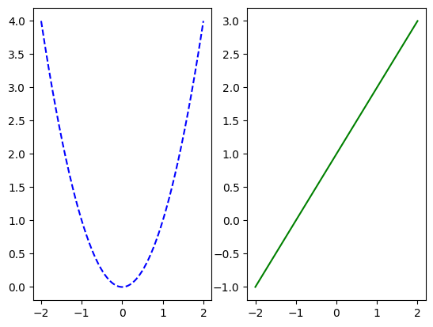
    


Para que las gráficas no queden tan ajustadas, podemos hacer la figura más grande.


```python
plt.figure(figsize=(14,6))

plt.subplot(1, 2, 1) # 1 rows, 1 columns, 1st subplot
plt.plot(x, y, 'b--')
plt.xlabel("x1", fontsize=14)
plt.ylabel("y1", fontsize=14)

plt.subplot(1, 2, 2) # 1 rows, 2 columns, 2nd subplot
plt.plot(x, y2, 'g')
plt.xlabel("x2", fontsize=14)
plt.ylabel("y2", fontsize=14)

plt.show()
```


    
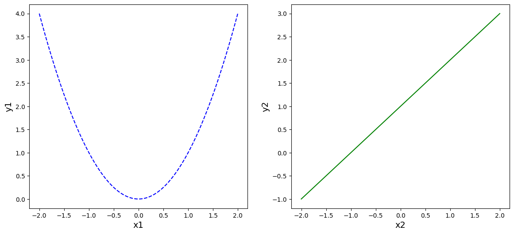
    


## Scatter plots


```python
from numpy.random import rand
x, y = rand(2, 100)
plt.scatter(x, y)
plt.show()
```


    
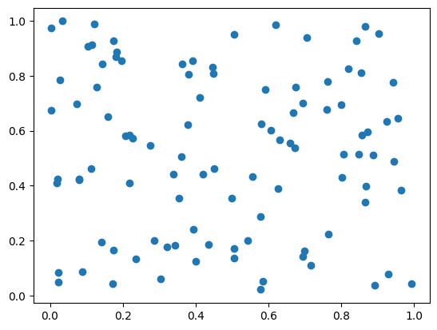
    


```python
from numpy.random import rand
x, y = rand(2, 100)
x2, y2 = rand(2, 100)
plt.scatter(x, y, c='red')
plt.scatter(x2, y2, c='blue')
plt.show()
```


    
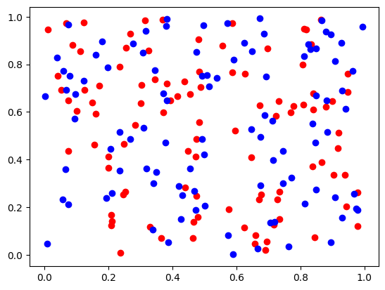
    


## Histogramas


```python
data = [1, 1.1, 1.8, 2, 2.1, 3.2, 3, 3, 3, 3]
plt.subplot(211) # 2 rows, 1 columns, 1st subplot
plt.hist(data, bins = 10, rwidth=0.8)

plt.subplot(212) # 2 rows, 1 columns, 2nd subplot
plt.hist(data, bins = [1, 1.5, 2, 2.5, 3], rwidth=0.95)
plt.xlabel("Value")
plt.ylabel("Frequency")

plt.show()
```


    
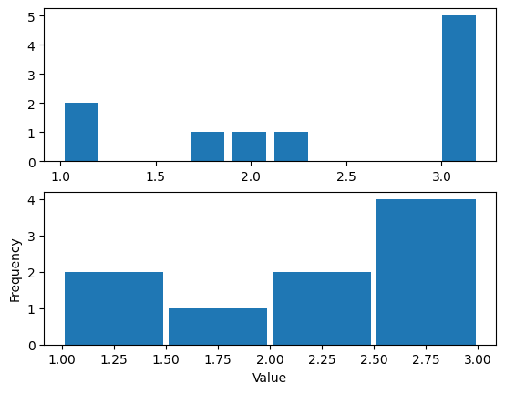
    


## Guardar las figuras


```python
import numpy as np
x = np.linspace(-2, 2, 500)
y = x**2
y2 = x + 1

plt.plot(x, y, 'b--', label="x**2")
plt.plot(x, y2, 'g', label="x+1")
plt.legend(loc="best")
plt.savefig("mi_grafica.png", transparent=True)
```


```python

```
